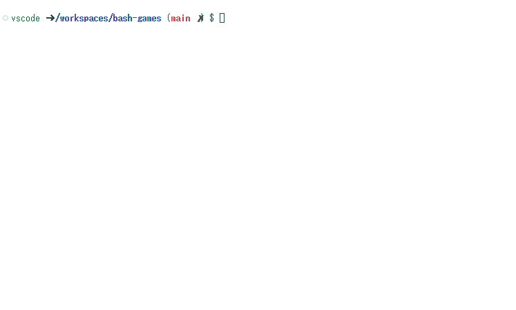
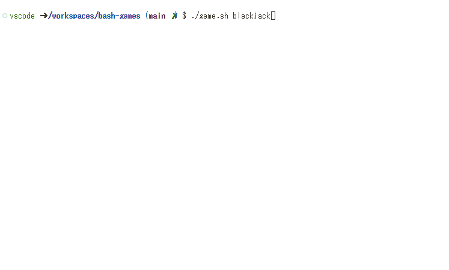

# bash-games

bashで動作する簡単なゲーム。  

## add-nums

コンソールに出力される4つの数字の和を計算します。  

  

## just10

10秒ぴったりでタイマーを止めます。  

  

## blackjack

ブラックジャックです。  
トランプの数字の和を21以内で、できるだけ21に近づけます。  
21を超えたらNGです。  

  

## 使い方

```shell
./game.sh add-nums
./game.sh just10
./game.sh blackjack
```
